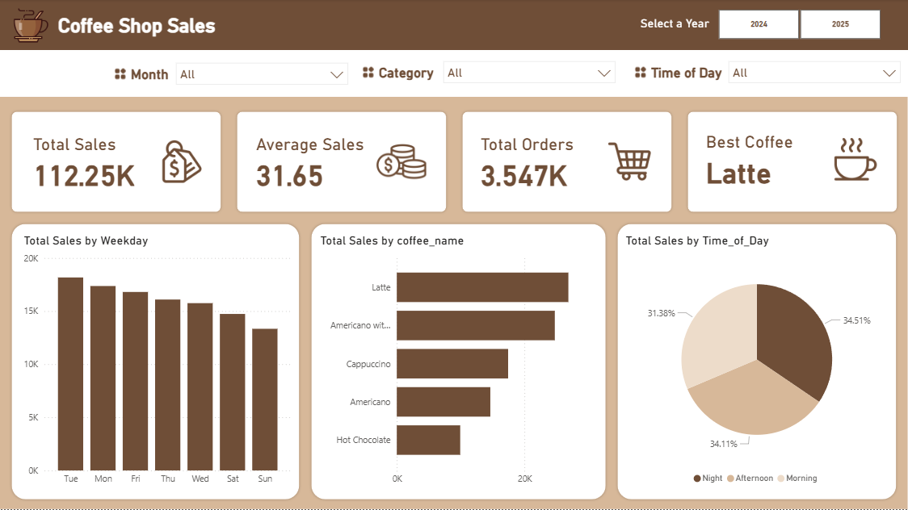

# ☕ Coffee Sales Data Analysis | Power BI Dashboard

 

## 📌 Project Overview
This project focuses on analyzing **coffee sales data** sourced from a public Kaggle dataset and transforming it into a meaningful insightful **interactive Power BI Dashboard**. The objective is to derive an actionable business insights related to sales performance, products trends and customer behaviors.

## 📂 Dataset

- Source: **Kaggle Coffee Sales dataset**
- Format: **Microsoft Excel**
- Type: **Transactional Sales Data**
- Column data example : 
  -	hour_of_day
  -	cash_type
  -	coffee_name
  -	Time_of_Day
  -	Month_name
  -	Date
  -	Time
  -	Etc.

## 🎯 Key Objectives Questions

At the heart of every business is a simple but important question: **How do we earn more Money?** 

To answer that, we first need to understand what is really happening in the business. By breaking this big question into smaller, more specific ones, we can uncover insights that truly matter to business owners. These insights will then be reflected in the dashboard, making it not just a collection of charts, but a tool for decision-making. Below are five key business questions that help turn coffee sales data into meaningful and actionable insights.

### 1. **How is overall coffee sales performance evolving across different time periods?**
- **Insight**: This question evaluates whether the coffee shop is growing, stable, or declining over time and provides a high-level performance benchmark for decision-makers.
- **Why it matters**: This establishes the performance baseline and signals when intervention is required.
---
### 2. **Which coffee products contribute the most to total sales, and which products underperform?**
- **Insight**: Identifies top performing products that should be prioritized and underperforming products that may require pricing, promotion, or removal strategies.
- **Why it matters**: Revenue is often driven by a small subset of products; optimizing the product mix directly improves profitability.
---
### 3. **When do customers generate the highest sales, and how does sales performance vary by time of day?**
- **Insight**: Supports operational optimization such as staffing schedules, inventory planning, and time-based promotions to maximize revenue during peak periods.
- **Why it matters**: Selling the right product at the right time maximizes revenue without increasing operational costs.
---
### 4. **How do customer purchasing behaviors impact average order value and repeat sales?**
- **Insight**: Analyze order size, purchase frequency, and product combinations to uncover upselling and bundling opportunities.
- **Why it matters**: Improving customer spend per transaction is often more cost-effective than acquiring new customers.
---
### 5. **What data-driven actions can be taken to improve coffee sales and where should the business focus first?**
- **Insight**: Transforms descriptive analytics into data-driven business actions, such as focusing on best-selling products, optimizing peak sales hours, and addressing weak sales periods.
- **Why it matters**: Executives care less about charts and more about clear decisions and next steps driven by data.

## 🛠 Tools & Technologies
- **Microsoft Power BI** 
  - Power Query (data cleaning & transformation)
  - DAX (calculated measures & KPIs)
- **Microsoft Excel**

## 📷 Dashboard Preview

- 📷 Dashboard preview images included in this repository
- 📁 Power BI file available for review

# Why This Project Matters

This project reflects real-world analyst responsibilities:
- Working with imperfect datasets
- Translating business questions into metrics
- Building dashboards that support decision-making
- Communicating insights clearly through visuals

## Reach out to me!

