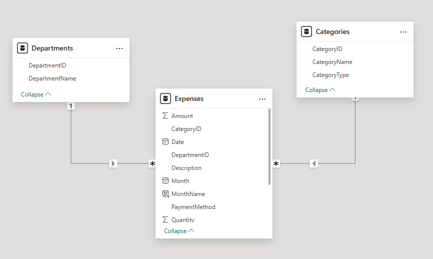
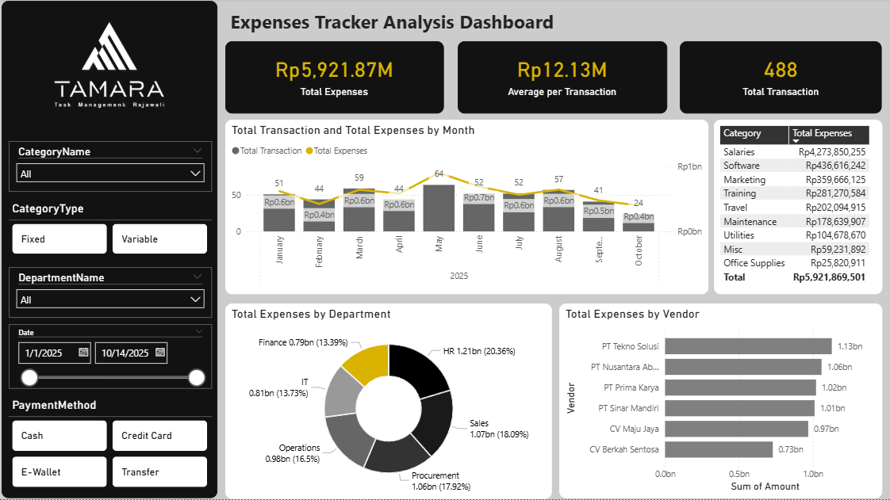

# 🧾 Expenses Analysis Dashboard | Power BI Dashboard

 

## 📌 Project Overview
This project focuses on **analyzing expenses** of a company and transforming it into an **insightful and interactive dashboard**. The objetive of this project is to ensure the understanding of information shown in the dashboard to derive an actionable insight of company expenses. By synthesizing complex spending patterns into intuitive visualizations, the dashboard ensures that company leadership can easily grasp the nuances of their operational costs at a glance. The primary goal is to empower decision makers to identify inefficiencies, monitor budget compliance, and implement **data driven cost reduction measures** that safeguard the organization's bottom line.

## 📂 Dataset
- Source: **Kaggle Coffee Sales dataset**
- Format: **Microsoft Excel**
### Data Relationship Preview

## 🎯 Key Objectives Questions
### **1. What is the total expenses made by the company?**
- **Insight**: 
- **Why it matters**: 
---
### **2. Which Categories Drive the Majority of Our Costs?**
- **Insight**: 
- **Why it matters**: 
---
### **3. Who are our Top 10 Vendors by expenses?**
- **Insight**: 
- **Why it matters**: 
---
### **4. How much does each department spend?**
- **Insight**: 
- **Why it matters**: 
---
### **5. What is the Month-over-Month (MoM) Expense Trend?**
- **Insight**: 
- **Why it matters**: 

## 🛠 Tools & Technologies
- **Microsoft Power BI** 
  - Power Query (data cleaning & transformation)
  - DAX (calculated measures & KPIs)
- **Microsoft Excel**

## 📷 Dashboard Preview

- 📷 Dashboard preview images included in this repository
- 📁 Power BI file available for review

## Reach out to me!

