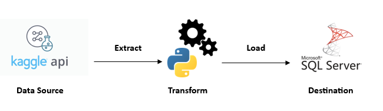
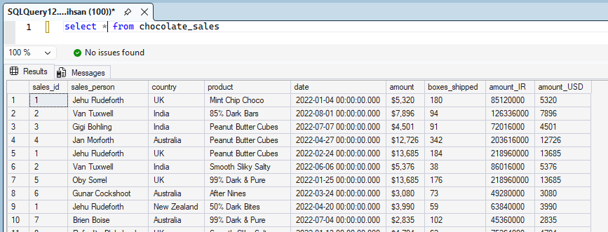

# 🔗 Simple ETL Python | Kaggle API to SQL Server

## 📌 Project Overview
This project demonstrates a simple **ETL pipeline built with Python** in VS Code. The purpose of this project is to understand what is an ETL and how to create a simple ETL pipeline from a data source into SQL Server for further use. This project showcases the development of an ETL pipeline designed to automate the lifecycle of data from ingestion to storage.

## What is ETL?
**ETL** stands for **Extract, Transform, and Load.** A foundational process in Data Engineering to move various data from various sources to a data warehouse or database.
- **Extract**: The process of retrieving raw data from a data source;
- **Transform**: The step where data is cleaned and formatted to ensure the data is "query ready";
- **Load**: The final step where the processed data is written into the target destination, such as a table in SQL Server.

From the image above we could understand the process of an ETL which extracts from a data source in this case Kaggle API and transform using Python, then Load into the target destination by connecting VS Code to SQL Server.

## The Pipeline Process
The primary language for scripting the logic and handling data manipulation we will be using is Python. It is an important step to know our device has been installed Python, in this case we are using VS Code for the source code editor.

### **1. Environment setup and API authentication**
First, we configure VS Code and install necessary libraries like pandas, sqlalchemy, and kaggle. We also ensure the Kaggle API credentials from this link [kaggle.json](https://www.kaggle.com/settings) are correctly placed to allow secure data retrieval. In the settings page you can scroll down until you find the menu **Legacy API Credentials** and click create Legacy API Key, this will download a file called Kaggle.json.

What you should do with the file is to move it into **Local Disk (C:)\Users\name\.kaggle** folder. This allows us to connect when Importing and authenticating Kaggle API to our editor.

### **2. Data Extraction**
```
import kaggle
kaggle.api.authenticate()
kaggle.api.dataset_download_files('atharvasoundankar/chocolate-sales', path='.', unzip=True)
```
The pipeline automates the flow of data from a Kaggle API source directly into a SQL Server database. By using the Chocolate Sales dataset [Chocolate Sales dataset](https://www.kaggle.com/datasets/atharvasoundankar/chocolate-sales).
After running the command, the dataset Chocolate Sales.csv will be downloaded into our folder.

- It is important to keep in mind if you want to change the dataset, in the command ...dataset_dowload_files('**CHANGE DATASET LINK**') <-- *Change the dataset link to the dataset you want*.
- ***Path='.'*** : is to keep the data files the same folder as your code
- ***unzip=True*** : the file extracted is in a zip File, so it is important to extract the csv file

After succesfully extracted the dataset from Kaggle API to our Editor, now comes the fun part in transforming the data.

### **3. Data Transformation (Python/Pandas)**

Once the raw data is in our environment, these are the list of transformation we are going to do in this case with the **Chocolate Sales Dataset**
- Replacing columns name into lower case and underscore
- Convert Amount column to Indonesian Rupiah
- Change column date data-type into Date
- Making an ID for each sales_person for Primary Key
- Moving sales_id column to the front row

These transformation command can be seen in the [Python file](ETL-kaggleAPI-SQL.py).

### **4. Loading to SQL Server**

Finally, we establish a connection to SQL Server using an ODBC driver and sqlalchemy. The cleaned DataFrame is then pushed into a structured table, making it available for SQL queries or visualization tools like Power BI or Tableau. In this case we are just pushing it into a structured table into SQL Server.

```
import sqlalchemy as sal
engine = sal.create_engine('mssql://DESKTOP-SQALVDR\SQLEXPRESS/test?driver=ODBC+DRIVER+17+FOR+SQL+SERVER')
conn = engine.connect()
df.to_sql('chocolate_sales', engine, if_exists='replace', index=False)
print(f"Successfully imported {len(df)} rows into {'chocolate_sales'}.")
```


In this step you need to have SQL Server already installed in your device which then you could write the name of the server in which mine is ***DESKTOP-SQALVDR\SQLEXPRESS***. Do not forget to create a new database in the **Databases** folder for the CSV file destination which is ***/test***.

Last but a crucial step is to add the ODBC Driver. **What is an ODBC Driver?**

- Python and SQL speaks in different languages internally, the ODBC Driver is the pipe between these two. Ensuring when Python sends a command, SQL Server will understand it.
- When you installed SQL Server, you could search **ODBC Data Sources** in your device from the windows button. Then you could add a User Data Source using **ODBC DRIVER 17 FOR SQL SERVER**

After succesfully running and connecting between Python and SQL Server, the CSV file would been in the database destination you have chosen. From there on out, the cleaned data could be used in creating many Business Insights and could create a Visualization Dashboard.



## Project Summary
This project demonstrates a streamlined ETL (Extract, Transform, Load) pipeline built with Python in VS Code. The pipeline automates the flow of data from a Kaggle API source directly into a SQL Server database. By using the Chocolate Sales dataset
, this project illustrates how to bridge the gap between raw external data and a structured environment ready for analysis and business intelligence.

## Why this Project Matters
By moving data from an API into a SQL environment, in this simple ETL pipeline project we unlock the ability in automation. While you can manually download a CSV file, open it in Excel to delete empty rows, and then copy-paste it into a database, an ETL pipeline turns those manual, error-prone steps into a **hands off software process.** ETL has been used in many ways by many companies, different datasets uses different transformation steps and different destination depends on the function of these datasets. But from this project, you have gone 1 step further in understanding ETL Pipeline.

From this project, I motivate myself in understanding ETL to further eases my data analyst projects into an automation. There is no limitation in this project to be developed in new and outstanding data function, please feel free to use this project as a stepping stone.


## Reach out to me!
[](https://www.linkedin.com/in/fadhil-azmi-ihsan/)
[](mailto:ihsanfadhilazmi@gmail.com)
