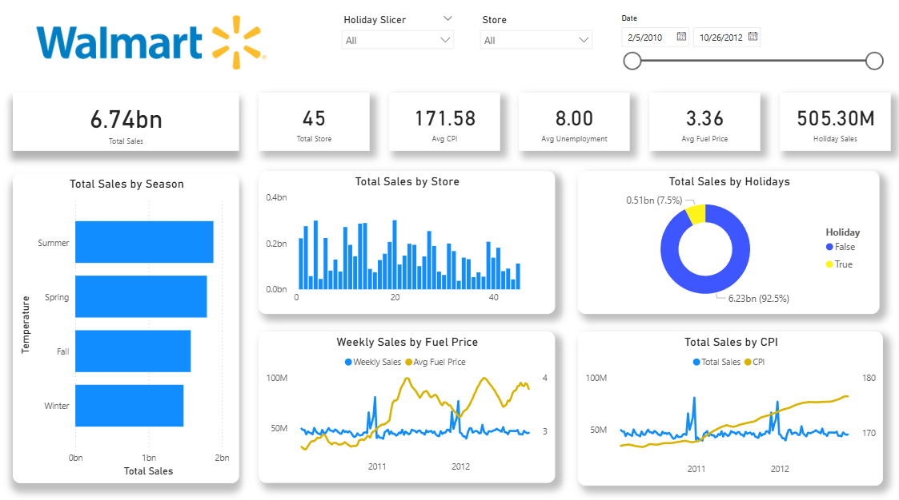

# 🛒 Walmart Sales Analysis | Power BI Dashboard

 

## 📌 Project Overview
This project focuses on analyzing supermarket sales data sourced from **kaggle walmart sales dataset** and transforming it into an insighful **interactive PowerBI dashboard.** The objective is to answer big business questions and  to derive an actionable business insights to further increase business income.

## 📂 Dataset
- Source: **Kaggle Coffee Sales dataset**
- Format: **Microsoft Excel**

## 🎯 Key Objectives Questions
### **1. Which Walmart stores contribute the most to total sales, and where are the underperforming stores?**
- **Insight**: Sales performance varies across stores, which means sales are not evenly spread accross all stores. A few locations generate a large share of revenue, while some stores generate a small share of revenue.
- **Why it matters**: Knowing which store performs well and which do not helps the business focus its efforts more effectively. Underperforming stores can be reviewed to identify opportunities for improvement.
---
### **2. How does seasonality affect Walmart’s sales performance throughout the year?**
- **Insight**: Sales are generally stronger during Spring and Summer and tend to decline during Fall and Winter, showing that customer buying behavior changes with the seasons.
- **Why it matters**: Understanding seasonal patterns allows Walmart to plan ahead. Better inventory planning, staffing, and promotions during high-demand seasons can improve sales while reducing unnecessary costs during slower periods.
---
### **3. How significant are holiday sales compared to non-holiday sales?**
- **Insight**: Holiday sales make up a smaller portion of total revenue, while most sales come from regular, non-holiday periods.
- **Why it matters**: This suggests that Walmart’s performance relies more on consistent weekly sales than on holiday spikes alone. It helps decision-makers evaluate whether holiday promotions are truly driving growth or just adding short-term increases.
---
### **4. How do external economic factors (CPI, fuel price, and unemployment) influence Walmart’s sales trends?**
- **Insight**: Even as fuel prices and inflation rise over time, Walmart’s sales remain relatively steady, with only occasional fluctuations.
- **Why it matters**:This shows that Walmart’s sales are fairly resilient during changing economic conditions. Understanding this relationship helps the business plan better during periods of economic uncertainty and adjust pricing or cost strategies when needed.
---
### **5. How have Walmart’s total sales evolved over time, and are there any notable trends or anomalies?**
- **Insight**: Overall sales remain stable across the time period, with a few noticeable spikes that may be linked to promotions, seasonal effects, or external events.
- **Why it matters**: Tracking sales over time helps the business separate normal patterns from unusual changes. This makes it easier to spot opportunities, manage risks, and make better decisions based on long-term trends.

## 🛠 Tools & Technologies
- **Microsoft Power BI** 
  - Power Query (data cleaning & transformation)
  - DAX (calculated measures & KPIs)
- **Microsoft Excel**

## 📷 Dashboard Preview

- 📷 Dashboard preview images included in this repository
- 📁 Power BI file available for review

# Why This Project Matters

## Reach out to me!

